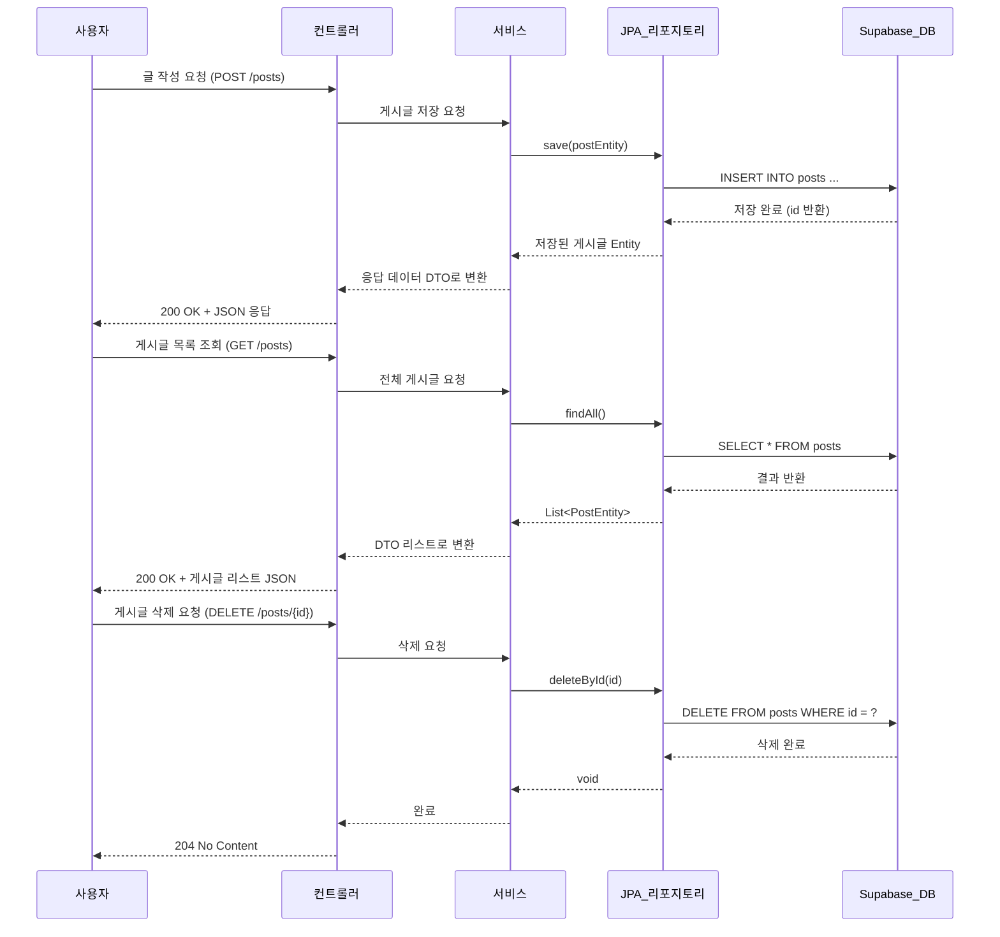

## CRUD End to End

---

### 🟩 1. Entity

📍위치: JPA_리포지토리 ↔ 서비스 ↔ Supabase_DB 사이에 쓰이는 내부 구조체

| 구분 | 설명 |
|--------------|----------------------------------------------------------------------|
내부 위치 | JPA Repository에서 사용하는 데이터 단위 (예: PostEntity)
작동 시점 | save(postEntity) 또는 findAll()로 가져온 결과 타입이 Entity
예시 | PostEntity ← @Entity, @Id, @Column으로 구성됨
핵심 역할 | DB 테이블과 직접 매핑되는 객체 (ORM Object)

➡️ 즉, Entity는 DB와 통신하는 유일한 자바 객체로

Repository에서 쿼리를 실행할 때도

DB에서 SELECT한 결과를 받을 때도

Entity 객체로 전달되고 반환돼요.

---

### 🟦 2. DTO (Data Transfer Object)

📍위치: 서비스 ↔ 컨트롤러 사이에서 사용

| 구분 | 설명 |
|--------------|----------------------------------------------------------------------|
내부 위치 | Controller로 보낼 때 혹은 받을 때 직접 사용되는 구조체
작동 시점 | Service 계층에서 Entity → DTO 변환 (PostEntity → PostResponseDto)
예시 | PostRequestDto, PostResponseDto
핵심 역할 | 사용자에게 보여줄 정보만 골라서 전달 / 받는 구조체 (보안 + 명확성)

➡️ 즉, DTO는 클라이언트와 주고받는 데이터의 형태로,

Controller에서는 Entity를 직접 다루지 않고 DTO만 사용

Service에서 Entity ↔ DTO로 변환

---

### 🟨 3. Supabase PostgreSQL

📍위치: Supabase_DB 라고 표기된 부분 그 자체

| 구분 | 설명 |
|--------------|----------------------------------------------------------------------|
내부 위치 | 다이어그램 제일 오른쪽 Supabase_DB
작동 시점 | Repository가 save, findAll, deleteById 등을 실행할 때 실제 SQL이 실행되는 대상
예시 | Supabase 콘솔에서 posts 테이블 직접 확인 가능
핵심 역할 | JPA가 실행하는 모든 쿼리의 최종 목적지인 실제 물리 DB 서버

➡️ Supabase는 Spring 앱 외부에 있는 PostgreSQL 호스팅 서비스예요.

---

### 🟣 4. Hibernate (JPA 구현체)

👉 위치: JPA_리포지토리 ↔ Supabase_DB 사이에 숨어 있음

| 구분 | 설명 |
|--------------|----------------------------------------------------------------------|
역할 | Repository에서 save(), findAll() 호출 시, 실제로는 Hibernate가 SQL로 변환하고 실행
작동 방식 | PostEntity를 SQL로 바꾸고 → JDBC로 전송
관련 설정 | spring.jpa.properties.hibernate.dialect, ddl-auto, 등

➡️ 즉, Hibernate는 JPA 명령을 SQL로 번역하고 실행하는 중간 엔진이에요.

---

### 🟡 5. JDBC Driver (org.postgresql.Driver)

👉 위치: Hibernate ↔ Supabase_DB 사이에 존재

| 구분 | 설명 |
|--------------|----------------------------------------------------------------------|
역할 | Hibernate가 생성한 SQL을 진짜 DB(PostgreSQL) 에 보낼 수 있도록 연결을 담당
작동 방식 | Java와 DB(PostgreSQL) 사이의 통역사
관련 설정 | spring.datasource.driver-class-name, url, username, password 등

➡️ 즉, JDBC 드라이버는 Hibernate가 만든 SQL을 실제 PostgreSQL 서버와 주고받는 통신 수단이에요.

---

### ✅ 6. JPA Repository

| 구분 | 설명 |
|--------------|----------------------------------------------------------------------|
정체 | JpaRepository<T, ID> 를 상속한 인터페이스
예시 | PostRepository extends JpaRepository<Post, Long>
목적 | DB와 직접 연결되는 계층, 즉, 서비스 계층이 실제로 SQL을 직접 다루지 않고도 DB 작업을 할 수 있게 해줌
제공 기능 | save(), findAll(), findById(), deleteById() 같은 기본 CRUD 메서드 제공
내부 동작 | Spring Data JPA가 자동으로 구현체를 만들어서, Hibernate를 통해 SQL을 실행함
