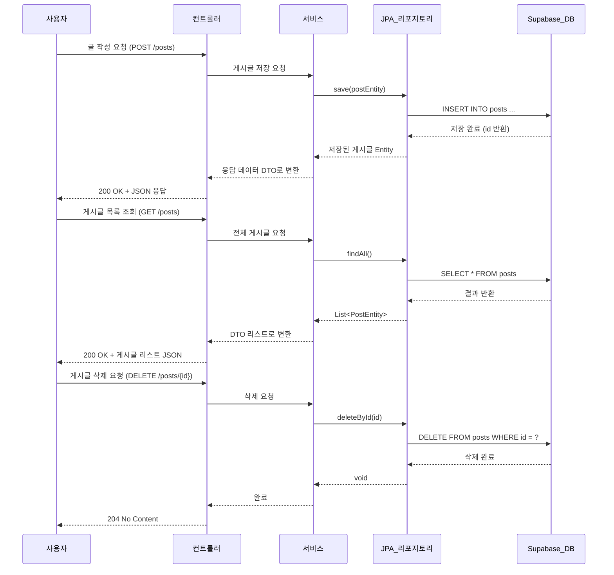

```mermaid
sequenceDiagram
    participant 사용자
    participant 컨트롤러
    participant 서비스
    participant JPA_리포지토리
    participant Supabase_DB

    사용자->>컨트롤러: 글 작성 요청 (POST /posts)
    컨트롤러->>서비스: 게시글 저장 요청
    서비스->>JPA_리포지토리: save(postEntity)
    JPA_리포지토리->>Supabase_DB: INSERT INTO posts ...
    Supabase_DB-->>JPA_리포지토리: 저장 완료 (id 반환)
    JPA_리포지토리-->>서비스: 저장된 게시글 Entity
    서비스-->>컨트롤러: 응답 데이터 DTO로 변환
    컨트롤러-->>사용자: 200 OK + JSON 응답

    사용자->>컨트롤러: 게시글 목록 조회 (GET /posts)
    컨트롤러->>서비스: 전체 게시글 요청
    서비스->>JPA_리포지토리: findAll()
    JPA_리포지토리->>Supabase_DB: SELECT * FROM posts
    Supabase_DB-->>JPA_리포지토리: 결과 반환
    JPA_리포지토리-->>서비스: List<PostEntity>
    서비스-->>컨트롤러: DTO 리스트로 변환
    컨트롤러-->>사용자: 200 OK + 게시글 리스트 JSON

    사용자->>컨트롤러: 게시글 삭제 요청 (DELETE /posts/{id})
    컨트롤러->>서비스: 삭제 요청
    서비스->>JPA_리포지토리: deleteById(id)
    JPA_리포지토리->>Supabase_DB: DELETE FROM posts WHERE id = ?
    Supabase_DB-->>JPA_리포지토리: 삭제 완료
    JPA_리포지토리-->>서비스: void
    서비스-->>컨트롤러: 완료
    컨트롤러-->>사용자: 204 No Content
```
